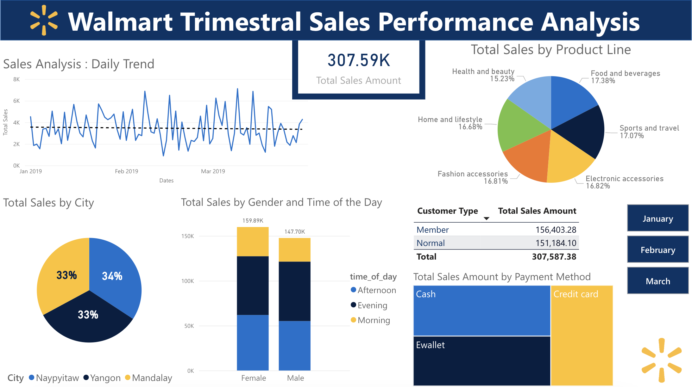

# Walmart_Sales_Analysis
A project to practice sales analysis using SQL on a fictive Walmart dataset.
The project data and questions are from [MohammedShehbazDamkar's Walmart-Sales-Data-Analysis--SQL-Project](https://github.com/MohammedShehbazDamkar/Walmart-Sales-Data-Analysis--SQL-Project).
**Find the answers [below](#data-wrangling)**


## Overview
This project aims to demonstrate analysis techniques using SQL and Power B. Using a Walmart's fictive sales data I answered 35 retail business-related questions to practice querying in SQL, and then created a dashboard of the results to practice communicating findings using Power Bi. 

## Data
The dataset `WalmartSalesData.csv` contains 17 columns and 1000 rows of sales data from Walmart branches located in Mandalay, Yangon, and Naypyitaw.

### Columns:
- `invoice_id`: Unique ID for each sales transaction
- `branch`: Branch identifier
- `city`: Branch location
- `customer_type`: Type of customer (Membership or Normal)
- `gender`: Customer gender
- `product_line`: Product category
- `unit_price`: Price of each product
- `quantity`: Number of units sold
- `tax_pct`: Tax percentage on the sale
- `total`: Total sale amount
- `date`: Date of transaction
- `time`: Time of transaction
- `payment`: Payment method
- `rating`: Customer satisfaction rating
- **Derived Columns:** `Total_Before_Tax`, `Sales_Status`, `time_of_day`, `day_of_week`, `month`

## Analysis sections
1. Product Analysis
2. Sales Analysis
3. Customer Analysis

## SQL Scripts
All SQL scripts for data loading, cleaning, feature engineering, and analysis can be found in the `sql_scripts/` folder.

## Dashboard 

Since the data is fictive, the point of this project is not to show analysis results but to demonstrate analysis techniques. 

## **Data Wrangling:**

This is the first step where inspection of data is done to make sure **NULL** values and missing values are detected and data replacement methods are used to replace, missing or **NULL** values.


```sql
-- verifying if we have any null values:
SELECT *
FROM sales
WHERE invoice_id IS NULL
   OR branch IS NULL
   OR city IS NULL
   OR customer_type IS NULL
   OR gender IS NULL
   OR product_line IS NULL
   OR unit_price IS NULL
   OR quantity IS NULL
   OR tax_pct IS NULL
   OR total IS NULL
   OR date IS NULL
   OR time IS NULL
   OR payment IS NULL
   OR cogs IS NULL
   OR gross_margin_pct IS NULL
   OR gross_income IS NULL
   OR rating IS NULL;
```

The result is an empty set .

> 2024-09-25 11:58:15 [ INFO] Result: Empty set in 586ms
> 

## **Feature Engineering:**


```sql
-- **Adding the New Columns**
ALTER TABLE sales
ADD COLUMN time_of_day VARCHAR(10),
ADD COLUMN day_of_week VARCHAR(10),
ADD COLUMN month VARCHAR(10);

-- **Updating the`time_of_day` column**
UPDATE sales
SET time_of_day = (   
    CASE
        WHEN `time` BETWEEN "00:00:00" AND "12:00:00"
        THEN  'Morning'
        WHEN `time` BETWEEN "12:01:00" AND "16:00:00"
        THEN  'Afternoon'
        ELSE 'Evening'
    END
);
-- **Updating the `day_of_week` column**
UPDATE sales
SET 
	day_of_week = DAYNAME(
		date
	);
-- **Updating the `month` column**
UPDATE SALES
SET
    MONTH = MONTHNAME(
        DATE
    );
```

## **Exploratory Data Analysis (EDA):**

Exploratory data analysis is done to answer the listed questions and aims of this project.

## **Business Questions For Analysis**

**Generic Questions**

1. How many unique cities does the data have?

```sql
SELECT
    COUNT(DISTINCT CITY)
FROM
    SALES;
```

> 3 cities.
> 

2. In which city is each branch?

```sql
SELECT
    DISTINCT BRANCH,
    CITY
FROM
    SALES;
```

| Branch | City |
| --- | --- |
| A | Yangon |
| B | Naypyitaw |
| B | Mandalay |

**Product Related Questions**

1. How many unique product lines does the data have?

```sql
SELECT
    COUNT(DISTINCT PRODUCT_LINE) AS nb_product_line
FROM
    SALES;
```

> 6 product lines.
> 

2. What is the most common payment method?

```sql
SELECT
    PAYMENT,
    COUNT(*) AS COUNT_PAYMENT
FROM
    SALES
GROUP BY
    payment
ORDER BY
    COUNT_PAYMENT DESC;
```

| PAYMENT | COUNT_PAYMENT |
| --- | --- |
| **Ewallet**	  |  **345** |
| Cash | 344 |
| Credit card | 311 |

3. What is the most selling product line?

```sql
SELECT
    PRODUCT_LINE,
    SUM(QUANTITY) AS GLOBAL_QUANTITY
FROM
    SALES
GROUP BY
    PRODUCT_LINE
ORDER BY
    GLOBAL_QUANTITY DESC;
```

| Product_line | global_quantity |
| --- | --- |
| **Electronic accessories** | **971** |
| Food and beverages | 952 |
| Sports and travel | 920 |
| Home and lifestyle | 911 |
| Fashion accessories | 902 |
| Health and beauty | 854 |

3. What is the total revenue by month?

```sql
SELECT
    MONTH,
    SUM(QUANTITY * UNIT_PRICE) AS TOTAL_INCOME
FROM
    SALES
GROUP BY
    MONTH
ORDER BY 
		TOTAL_INCOME
		DESC;
```

| 	Month | Total_income |
| --- | --- |
| **January** |    **110754.16** |
| March |   104243.34 |
| February |     92589.88 |

5. What product line had the largest revenue?

```sql
SELECT
    PRODUCT_LINE,
    SUM(TOTAL_BEFORE_TAX) AS TOTAL_REVENUE
FROM
    SALES
GROUP BY
    PRODUCT_LINE
ORDER BY
    TOTAL_REVENUE DESC;
```

| **Product_line** | **Total_revenue** |
| --- | --- |
| Food and beverages | 53471.2800 |
| Sports and travel | 52497.9300 |
| Electronic accessories | 51750.0300 |
| Fashion accessories | 51719.9000 |
| Home and lifestyle | 51297.0600 |
| Health and beauty | 46851.1800 |

6. What is the city with the largest revenue?

```sql
SELECT
    CITY,
    SUM(TOTAL_BEFORE_TAX) AS TOTAL_REVENUE
FROM
    SALES
GROUP BY
    CITY
ORDER BY
    TOTAL_REVENUE DESC;
```

| City | Total_revenue |
| --- | --- |
| Naypyitaw | 105303.5300 |
| Yangon | 101143.2100 |
| Mandalay | 101140.6400 |

7. What product line had the largest VAT?

```sql
SELECT
    PRODUCT_LINE,
    MAX(tax_pct) AS LARGEST_TAX
FROM
    SALES
GROUP BY
    PRODUCT_LINE
ORDER BY
    LARGEST_TAX DESC;
```

| Product_line | Largest_tax |
| --- | --- |
| Fashion accessories | 49.6500 |
| Food and beverages | 49.2600 |
| Home and lifestyle | 48.7500 |
| Sports and travel | 47.7200 |
| Health and beauty | 45.2500 |
| Electronic accessories | 44.8785 |

8. Fetch each product line and add a column to those product line showing "Good", "Bad". Good if its greater than average sales
    a. Calculating the average sales:
        
        ```sql
        SELECT AVG(Total_Before_Tax) AS avg_sales
        FROM sales;
        ```
        
        > Average sales = 307.58738000
        > 
        
    b. Adding and populating a sales_status column to the sales table :
    
    ```sql
    ALTER TABLE SALES
    ADD COLUMN SALES_STATUS  VARCHAR(10)
    
    UPDATE SALES
    SET
        SALES_STATUS= CASE WHEN TOTAL_BEFORE_TAX >= 307.58738000 THEN "GOOD" ELSE "BAD" END;
    ```
    

9. Which branch sold more products than average product sold?

```sql
SELECT
    BRANCH,
    SUM(QUANTITY) AS SOLD_PRODUCTS_NUMBER
FROM
    SALES
GROUP BY
    BRANCH
HAVING
    SUM(QUANTITY) > (SELECT AVG(TotalQuantity) FROM (SELECT SUM(QUANTITY) AS TotalQuantity FROM SALES GROUP BY BRANCH) AS BranchSales)
ORDER BY
    SOLD_PRODUCTS_NUMBER DESC;
```

> Branch A with 1859 products
> 

10. What is the most common product line by gender?

```sql
-- THE SUBQUERY
SELECT
    GENDER,
    PRODUCT_LINE,
    COUNT(*) AS PRODUCT_COUNT,
    RANK() OVER(PARTITION BY GENDER ORDER BY COUNT(*) DESC)
FROM
    SALES
GROUP BY
    GENDER,
    PRODUCT_LINE;
    
-- THE FULL QUERY
SELECT
    GENDER,
    PRODUCT_LINE,
    PRODUCT_COUNT
FROM
    (
        SELECT
            GENDER,
            PRODUCT_LINE,
            COUNT(*)AS PRODUCT_COUNT,
	          RANK() OVER(PARTITION BY GENDER ORDER BY COUNT(*) DESC) AS RANKING
        FROM
            SALES
        GROUP BY
            GENDER,
            PRODUCT_LINE) AS RANK_OF_PRODUCTS     
WHERE
    RANKING = 1;
    
```

| Gender | Product_line | Product_count |
| --- | --- | --- |
| Female | Fashion accessories | 96 |
| Male | Health and beauty | 88 |

11. What is the average rating of each product line?

```sql
SELECT
    PRODUCT_LINE,
    AVG(RATING)  AS AVERAGE_RATING
FROM
    SALES
GROUP BY
    PRODUCT_LINE;
```

| Product_line | Average_rating |
| --- | --- |
| Home and lifestyle | 6.83750 |
| Sports and travel | 6.91627 |
| Electronic accessories | 6.92471 |
| Health and beauty | 7.00329 |
| Fashion accessories | 7.02921 |
| Food and beverages | 7.11322 |

**Sales Related Questions**

1. Number of sales made in each time of the day per weekday

```sql
SELECT
    TIME_OF_DAY,
    SUM(TOTAL_BEFORE_TAX) AS NUMBER_OF_SALES
FROM
    SALES
GROUP BY
    TIME_OF_DAY
ORDER BY
    NUMBER_OF_SALES;
```

| Time_of_day | Number_of_sales |
| --- | --- |
| Morning | 58856.0100 |
| Afternoon | 116949.5400 |
| Evening | 116949.5400 |

2. Which of the customer types brings the most revenue?

```sql
SELECT
    CUSTOMER_TYPE,
    SUM(TOTAL_BEFORE_TAX) AS TOTAL_REVENUE,
    RANK() OVER (ORDER BY SUM(TOTAL_BEFORE_TAX) DESC) AS RANKING
FROM
    SALES
GROUP BY
    CUSTOMER_TYPE;
```

| Costumer_type | Total_revenue | Ranking |
| --- | --- | --- |
| Member | 156403.2800 | 1 |
| Normal | 151184.1000 | 2 |

3. Which city has the largest tax percent/ VAT (**Value Added Tax**)?

```sql
SELECT
    CITY,
    MAX(TAX_PCT) AS HIGHEST_TAX_PCT
FROM
    SALES
GROUP BY
    CITY
order by
    HIGHEST_TAX_PCT;
```

| City | Highest_tax_pct |
| --- | --- |
| Mandalay | 48.6900 |
| Yangon | 49.4900 |
| Naypyitaw | 49.6500 |

4. Which customer type pays the most in VAT?

```sql
SELECT
    CUSTOMER_TYPE,
    SUM(TAX_PCT*TOTAL_BEFORE_TAX) AS AMOUNT_PAID_TAX
FROM
    SALES
GROUP BY
    CUSTOMER_TYPE
ORDER BY
    AMOUNT_PAID_TAX DESC;
```

| Customer_type | AMOUNT_PAID_TAX |
| --- | --- |
| Member | 3835894.5535 |
| Normal | 3633795.2137 |

**Customer**

1. How many unique customer types does the data have?

```sql
SELECT
    COUNT(DISTINCT CUSTOMER_TYPE) AS NUMBER_OF_CUSTOMER_TYPES
FROM
    SALES;
```

> 2 costumer types.
> 

2. How many unique payment methods does the data have?

```sql
SELECT
    COUNT(DISTINCT payment) AS NUMBER_OF_PAYMENT_METHODS
FROM
    SALES;
```

> 3 Payment methods.
> 

3. What is the most common customer type?

```sql
SELECT
    CUSTOMER_TYPE,
    COUNT(*)AS CUSTOMER_TYPE_COUNT
FROM
    SALES
GROUP BY
    CUSTOMER_TYPE
ORDER BY
    CUSTOMER_TYPE_COUNT DESC;
```

| Customer_type | count |
| --- | --- |
| Member  | 501 |
| Normal | 499 |

4. Which customer type buys the most?

```sql
-- in quantity
SELECT
    CUSTOMER_TYPE,
    SUM(QUANTITY) AS QUANTITY_BOUGHT
FROM
    SALES
GROUP BY
    CUSTOMER_TYPE
ORDER BY
    QUANTITY_BOUGHT DESC;
    
  --In paid amount
SELECT
    CUSTOMER_TYPE,
    SUM(TOTAL_BEFORE_TAX) AS PAID_UNTAXED
FROM
    SALES
GROUP BY
    CUSTOMER_TYPE
ORDER BY
    PAID_UNTAXED DESC;
```

In quantity:

| Customer_type | QUANTITY_BOUGHT  |
| --- | --- |
| Member  | 2785 |
| Normal | 2725 |

In paid amount

| Customer_type |  PAID_UNTAXED |
| --- | --- |
| Member  | 156403.2800 |
| Normal | 151184.1000 |

5. What is the gender of most of the customers?

```sql
SELECT
    GENDER,
    COUNT(*) AS CUSTOMER_TYPE_COUNT
FROM
    SALES
GROUP BY
    GENDER
ORDER BY
    CUSTOMER_TYPE_COUNT DESC;
```

| Gender | Customer_type_count |
| --- | --- |
| female | 501 |
| male | 499 |

A very slight difference

6. What is the gender distribution per branch?

```sql
SELECT
    BRANCH,
    GENDER,
    count(*)
FROM
    SALES
GROUP BY BRANCH, GENDER
ORDER BY BRANCH;
```

| Branch | Gender | Count |
| --- | --- | --- |
| A | Female | 161 |
| A | Male | 179 |
| B | Female | 162 |
| B | Male | 170 |
| C | Female | 178 |
| C | Male | 150 |

7. Which time of the day do customers give the MOST ratings?

```sql
WITH RANKED_RATINGS AS (
    SELECT
        TIME_OF_DAY,
        COUNT(RATING) AS RATINGS_COUNT,
        RANK() OVER(ORDER BY COUNT(RATING) DESC) AS RANKING
    FROM
        SALES
    GROUP BY
        TIME_OF_DAY
)
SELECT
    TIME_OF_DAY,
    RATINGS_COUNT
FROM
    RANKED_RATINGS
ORDER BY
    RANKING;
```

| Time of Day | Number of Ratings |
| --- | --- |
| Evening | 432 |
| Afternoon | 377 |
| Morning | 191 |

8. Which time of the day do customers give most ratings per branch?

```sql
WITH RANKED_RATING AS (
    SELECT
        BRANCH,
        TIME_OF_DAY,
        COUNT(RATING) AS COUNT_RATING,
        RANK() OVER (PARTITION BY BRANCH ORDER BY COUNT(RATING) DESC) AS RANKING
    FROM
        SALES
    GROUP BY
        BRANCH, TIME_OF_DAY
)
SELECT
    BRANCH,
    TIME_OF_DAY,
    COUNT_RATING
FROM
    RANKED_RATING
WHERE
    RANKING = 1
ORDER BY
    COUNT_RATING DESC;
```

| Branch | Time of Day | Count_Ratings |
| --- | --- | --- |
| B | Evening | 148 |
| C | Evening | 143 |
| A | Evening | 141 |

9. Which day of the week has the best avg ratings?

```sql
WITH RANKED_RATINGS AS (
    SELECT
        day_of_week,
        AVG(RATING) AS RATINGS_avg,
        RANK() OVER(ORDER BY avg(RATING) DESC) AS RANKING
    FROM
        SALES
    GROUP BY
        DAY_OF_WEEK
)
SELECT
    DAY_OF_WEEK,
    RATINGS_AVG
FROM
    RANKED_RATINGS
ORDER BY
    RANKING;
```

| Day | Value |
| --- | --- |
| Monday | 7.15360 |
| Friday | 7.07626 |
| Sunday | 7.01128 |
| Tuesday | 7.00316 |
| Saturday | 6.90183 |
| Thursday | 6.88986 |
| Wednesday | 6.80559 |

10. Which day of the week has the best average ratings per branch?

```sql
WITH RANKED_RATINGS AS (
    SELECT
        BRANCH,
        DAY_OF_WEEK,
        AVG(RATING)AS RATINGS_AVG,
        RANK() OVER(PARTITION BY BRANCH ORDER BY AVG(RATING) DESC) AS RANKING
    FROM
        SALES
    GROUP BY
        BRANCH,
        DAY_OF_WEEK
)
SELECT
    BRANCH,
    DAY_OF_WEEK,
    RATINGS_AVG
FROM
    RANKED_RATINGS
WHERE
    RANKING = 1
ORDER BY
    RATINGS_AVG DESC;
```

| Branch | Day | Value |
| --- | --- | --- |
| B | Monday | 7.33590 |
| A | Friday | 7.31200 |
| C | Friday | 7.27895 |

